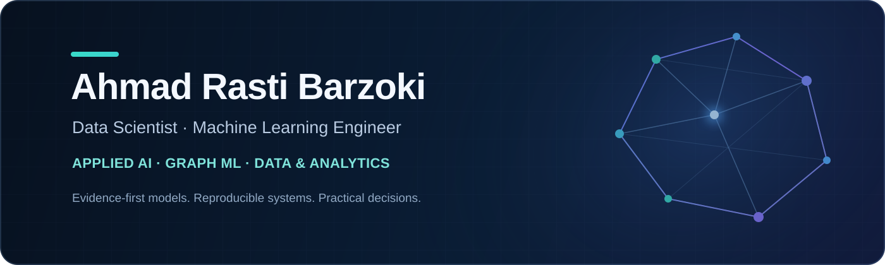

<p align="center">
  
</p>

<p align="center">
  <a href="https://linkedin.com/in/ahmad-rasti-barzoki"></a>
  <a href="https://github.com/ahmadrasti?tab=repositories"></a>
</p>

## Building useful systems from data and research

I am a Data Scientist and Machine Learning Engineer working across **applied AI, Graph ML, forecasting, and analytics engineering**. I turn analytical questions and research ideas into reproducible workflows—with explicit assumptions, defensible evaluation, and practical outputs.

My work is guided by three principles:

- **Evidence before claims** — results should be traceable to data, code, and evaluation design.
- **Reproducibility by default** — documented environments, deterministic runs, tests, and clear data policies.
- **Responsible delivery** — private, collaborative, or unpublished material stays private until it is safe to share.

## Selected work

### [Retail Analytics Engineering](https://github.com/ahmadrasti/retail-analytics-engineering)

A reproducible clean-room retail analytics engineering project using fully synthetic data, with deterministic data generation, validation, dimensional analysis, testing, and CI.

`Python` · `pandas` · `Data Engineering` · `Analytics Engineering` · `Testing` · `GitHub Actions`

> Additional Graph ML, forecasting, and applied-ML case studies are being prepared for public release after reproducibility and publication review.

## Areas of focus

| Applied machine learning | Graph ML & research | Data & analytics |
|:---|:---|:---|
| Reliable baselines, evaluation, and model interpretation | Graph representation learning and anomaly detection | Python/SQL pipelines, KPI systems, and decision support |
| Time-series and forecasting workflows | Experiment design, ablations, and limitations | Reproducible reporting and privacy-aware AI integration |

## Technical toolkit

**Core:** Python · SQL · pandas · NumPy · scikit-learn  
**ML & research:** PyTorch · TensorFlow · Graph Neural Networks · Deep Learning  
**Engineering:** Git · testing · CI · reproducible environments · data validation  
**Data & BI:** Power BI · Apache Superset · MySQL · PostgreSQL  
**Communication:** technical documentation · data visualization · research reporting

## How I work

```text
Question → Data contract → Reproducible pipeline → Valid evaluation → Clear decision
```

I value simple architectures that can be explained, tested, and maintained. For research-facing work, I document data provenance, experimental assumptions, limitations, and the boundary between public evidence and unpublished results.

## Contact

- [LinkedIn — Ahmad Rasti Barzoki](https://linkedin.com/in/ahmad-rasti-barzoki)
- [GitHub — @ahmadrasti](https://github.com/ahmadrasti)
- [ORCID — 0009-0002-7820-1497](https://orcid.org/0009-0002-7820-1497)

<p align="center"><sub>Open to data science, machine learning, applied AI, and research collaborations.</sub></p>
